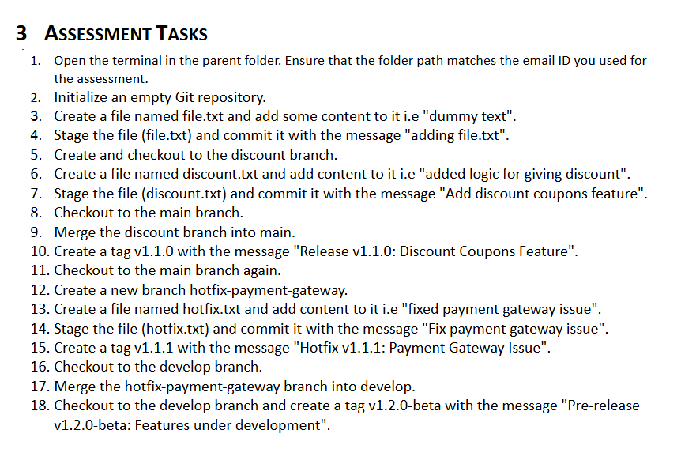

# Assignment 1

## Git Tags with Branches




```sh
git init

echo "dummy text" > file.txt
git add file.txt
git commit -m "adding file.txt"

git checkout -b discount

echo "added logic for giving discount" > discount.txt
git add discount.txt
git commit -m "Add discount coupons feature"

git checkout main || git checkout -b main
git merge discount
git tag -a v1.1.0 -m "Release v1.1.0: Discount Coupons Feature"

git checkout -b hotfix-payment-gateway

echo "fixed payment gateway issue" > hotfix.txt
git add hotfix.txt
git commit -m "Fix payment gateway issue"
git tag -a v1.1.1 -m "Hotfix v1.1.1: Payment Gateway Issue"

git checkout develop || git checkout -b develop
git merge hotfix-payment-gateway
git tag -a v1.2.0-beta -m "Pre-release v1.2.0-beta: Features under development"
```