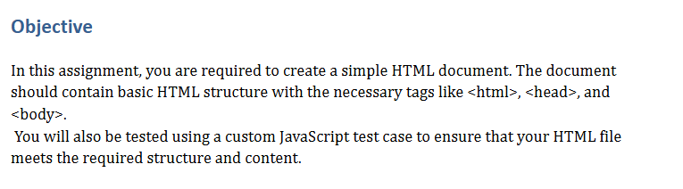
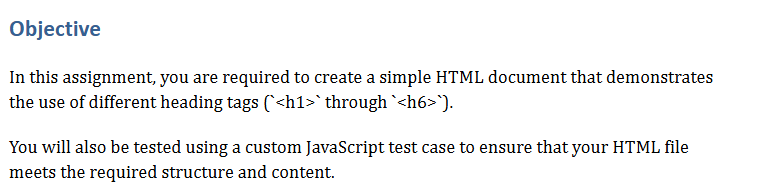
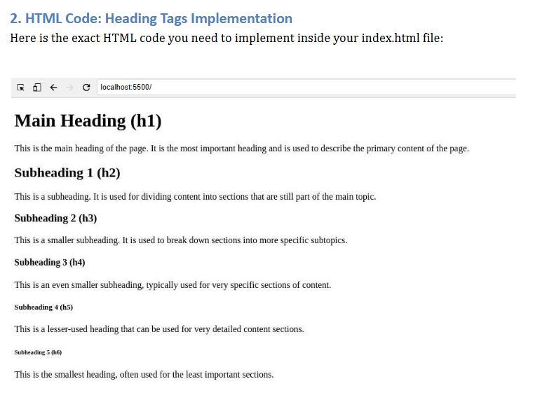
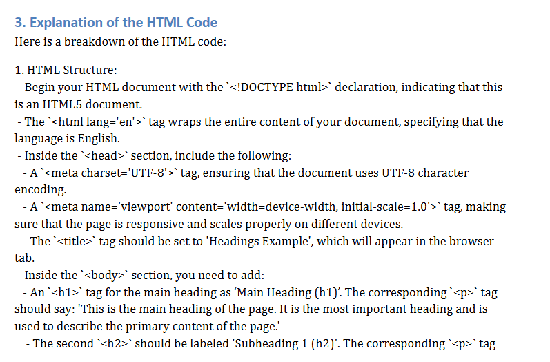
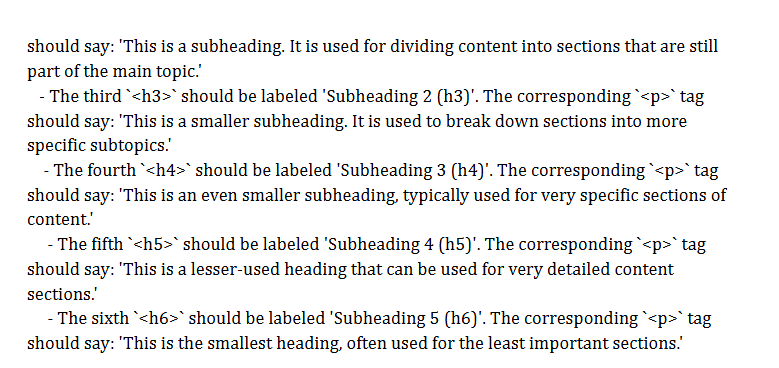

# HTML5

## Assignment 1: HTML Basics




```html
<!DOCTYPE html>
<html lang="en">
<head>
  <meta charset="UTF-8">
  <meta name="viewport" content="width=device-width, initial-scale=1.0">
  <title>My First HTML Program</title>
</head>
<body>

  <h1>Welcome to My First HTML Program</h1>

  <p>This is my first HTML program. I am learning how to write basic HTML code!</p>
  <p>HTML stands for HyperText Markup Language, and it is used to create the structure of web pages.</p>
  <p>HTML elements are the building blocks of web pages, and each element is defined using tags like <code>&lt;p&gt;</code> for paragraphs and <code>&lt;title&gt;</code> for the title of the page.</p>

</body>
</html>
```

## Assignment 2: HTML Heading Tags









```html
<!DOCTYPE html>
<html lang="en">
<head>
  <meta charset="UTF-8">
  <meta name="viewport" content="width=device-width, initial-scale=1.0">
  <title>Headings Example</title>
</head>
<body>

  <h1>Main Heading (h1)</h1>
  <p>This is the main heading of the page. It is the most important heading and is used to describe the primary content of the page.</p>

  <h2>Subheading 1 (h2)</h2>
  <p>This is a subheading. It is used for dividing content into sections that are still part of the main topic.</p>

  <h3>Subheading 2 (h3)</h3>
  <p>This is a smaller subheading. It is used to break down sections into more specific subtopics.</p>

  <h4>Subheading 3 (h4)</h4>
  <p>This is an even smaller subheading, typically used for very specific sections of content.</p>

  <h5>Subheading 4 (h5)</h5>
  <p>This is a lesser-used heading that can be used for very detailed content sections.</p>

  <h6>Subheading 5 (h6)</h6>
  <p>This is the smallest heading, often used for the least important sections.</p>

</body>
</html>
```

## Assignment 3: HTML-Inserting images

